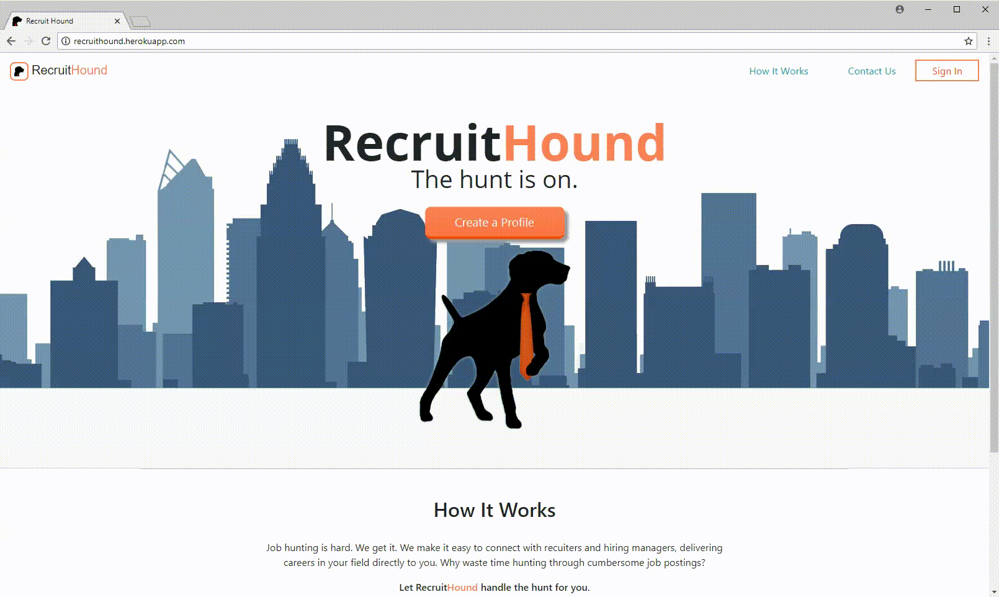

# RecruitHound
## A progressive web app connecting developers and recruiters

Live Demo: [https://recruithound.herokuapp.com/](https://recruithound.herokuapp.com/)

**Summary**
* Connects new developers with recruiters in their area. Answering the need for a centralized repository of recruiters operating in a given region.

* Built using MERN Stack (MongoDB, Express, React, Node.js), JavaScript, PassportJS, Flexbox, Bootstrap

**To run project**
* After cloning git repo, from your terminal run **`npm install`** to install all dependencies
* Then, from the project root, run **`npm run dev`**
  

